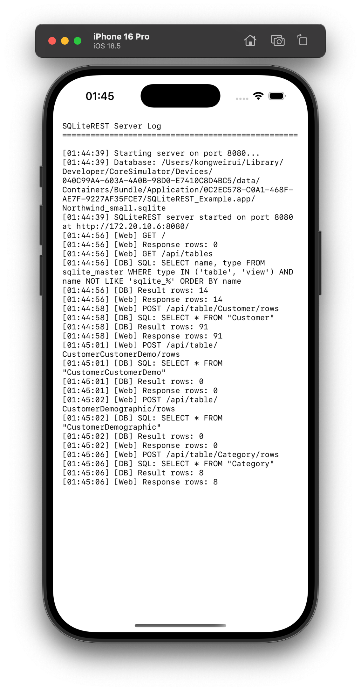
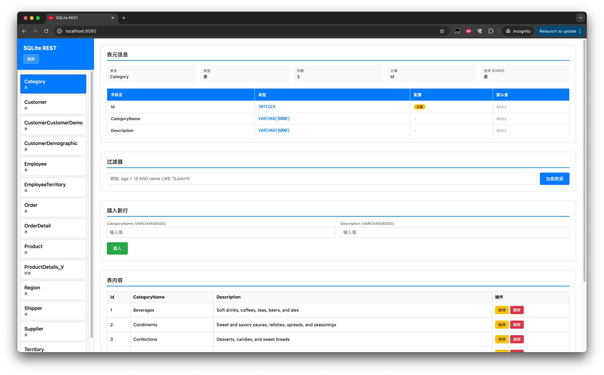

# SQLiteREST

[](https://travis-ci.org/Weirui Kong/SQLiteREST)
[](https://cocoapods.org/pods/SQLiteREST)
[](https://cocoapods.org/pods/SQLiteREST)
[](https://cocoapods.org/pods/SQLiteREST)

A lightweight RESTful service for SQLite databases running on iOS devices. SQLiteREST provides a simple web UI that allows you to view and edit your device's SQLite database in real-time, making it extremely convenient for development and QA testing. No more manually exporting sandbox files to troubleshoot issues!

一个运行在 iOS 设备上的轻量级 SQLite RESTful 服务。SQLiteREST 提供了一个简单的 Web UI，让你可以实时查看和编辑设备上的 SQLite 数据库，这对于开发和 QA 测试来说非常方便。再也不用手动导出沙盒文件来排查问题了！

## Features

- 🚀 **RESTful API**: Access your SQLite database via HTTP endpoints
- 🌐 **Web UI**: Built-in web interface for browsing and editing database content
- 📱 **Real-time Access**: View and modify your database directly on the device
- 🔧 **Development Tool**: Perfect for debugging and QA testing
- 📦 **Easy Integration**: Simple CocoaPods installation
- 🔌 **Universal Compatibility**: Works with any SQLite3-based database

## Requirements

- iOS 13.0+
- Xcode 12.0+
- CocoaPods 1.10.0+

## UI

<table>
  <tr>
    <td style="text-align:center;">
      
      <br/>App
    </td>
    <td style="text-align:center;">
      
      <br/>Web UI
    </td>
  </tr>
</table>

## Installation

SQLiteREST is available through [CocoaPods](https://cocoapods.org). To install it, simply add the following line to your `Podfile`:

```ruby
pod 'SQLiteREST'
```

Then run:

```bash
pod install
```

## Usage

### Basic Setup

1. Import the framework:

```swift
import SQLiteREST
```

2. Get the shared server instance and start it:

```swift
let server = SQLiteRESTServer.sharedInstance()

// Optional: Set up log handler
server.logHandler = { message in
    print("SQLiteREST: \(message)")
}

// Start the server on a port with your database path
let databasePath = // Your SQLite database file path
server.startServerOnPort(8080, withPath: databasePath)
```

3. Access the web UI by navigating to `http://<device-ip>:8080` in your browser (make sure your device and computer are on the same network).

### Example

The example project demonstrates how to use SQLiteREST with the [Northwind SQLite3 database](https://github.com/jpwhite3/northwind-SQLite3). To run the example:

1. Clone the repo
2. Run `pod install` from the Example directory
3. Open `Example/SQLiteREST.xcworkspace`
4. Build and run the app
5. Access the web UI at `http://<device-ip>:8080`

## ⚠️ Important Warnings

### Security Notice

**SQLiteREST is designed for development and testing purposes only. DO NOT use it in production builds.**

1. **Debug/Internal Testing Only**: Always ensure SQLiteREST is only included in debug or internal testing builds. Use conditional compilation to exclude it from release builds:

```swift
#if DEBUG
    let server = SQLiteRESTServer.sharedInstance()
    server.startServerOnPort(8080, withPath: databasePath)
#endif
```

2. **No Structured Query Validation**: The service does not perform structured query validation. Results may be incorrect, and **database corruption is possible**. 

3. **No Important Data**: **Never use SQLiteREST with databases containing important or sensitive data**. Always use test databases or ensure you have proper backups.

4. **Network Security**: The server runs on your local network without authentication. Make sure you're on a secure network when using this tool.

## API Documentation

For detailed API documentation, see [api.md](api.md).

## Demo Database

The example app uses the [Northwind SQLite3 database](https://github.com/jpwhite3/northwind-SQLite3) as a sample database to demonstrate SQLiteREST's capabilities. The Northwind database is a classic sample database that includes customers, orders, products, employees, and more.

## License

SQLiteREST is available under the MIT license. See the [LICENSE](LICENSE) file for more info.

## Contributing

Contributions are welcome! Please feel free to submit a Pull Request.
